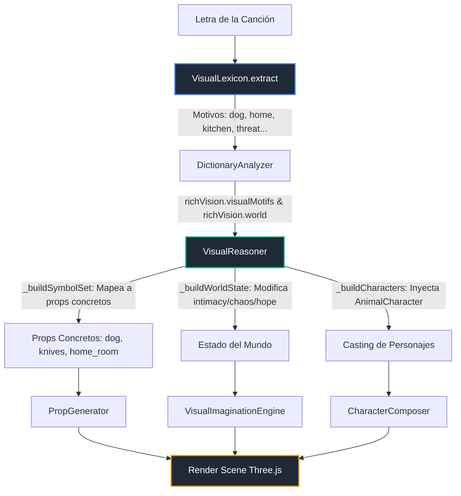

# Aurora Letras · Parche Narrativo y Visual

> **Estado:** Propuesta de Arquitectura / Parche Técnico  
> **Componente:** `scene-engine/`  
> **Objetivo:** Vincular la semántica de la letra de las canciones con la generación de objetos 3D, entornos y personajes narrativos concretos (eliminando fallbacks abstractos genéricos).

---

## 📋 Índice
1. [Resumen Ejecutivo y Diagnóstico](#-resumen-ejecutivo-y-diagnóstico)
2. [Diagrama de Flujo de la Arquitectura](#-diagrama-de-flujo-de-la-arquitectura)
3. [Especificación de Cambios por Archivo](#-especificación-de-cambios-por-archivo)
   - [3.1 Nuevo: `scene-engine/analysis/VisualLexicon.js`](#31-nuevo-scene-engineanalysisvisuallexiconjs)
   - [3.2 Modificar: `scene-engine/analysis/DictionaryAnalyzer.js`](#32-modificar-scene-engineanalysisdictionaryanalyzerjs)
   - [3.3 Modificar: `scene-engine/director/VisualReasoner.js`](#33-modificar-scene-enginedirectorvisualreasonerjs)
   - [3.4 Modificar: `scene-engine/generators/PropGenerator.js`](#34-modificar-scene-enginegeneratorspropgeneratorjs)
   - [3.5 Modificar: `scene-engine/director/VisualImaginationEngine.js`](#35-modificar-scene-enginedirectorvisualimaginationenginejs)
   - [3.6 Nuevo: `scene-engine/characters/AnimalCharacter.js` & `CharacterComposer.js`](#36-nuevo-scene-enginecharactersanimalcharacterjs--charactercomposerjs)
   - [3.7 Modificar: `proyector.html`](#37-modificar-proyectorhtml)
4. [Orden de Implementación y Pruebas](#-orden-de-implementación-y-pruebas)
5. [Protocolo de Verificación ("Flaca")](#-protocolo-de-verificación-flaca)

---

## 🔍 Resumen Ejecutivo y Diagnóstico

### El Problema
Al procesar canciones con alta carga narrativa doméstica o figurativa (ejemplo: *"Flaca"* de Andrés Calamaro), el motor detecta el ritmo y las emociones generales, pero **no representa los objetos clave de la letra**. Palabras como *perro*, *hogar*, *comida*, *regreso* o *puñales* son ignoradas, y el motor recurre a un fallback de cristales y cubos abstractos flotantes (`glowing_crystals`).

> [!NOTE]
> No se requiere cambiar de motor gráfico (Three.js). El problema reside en la **ausencia de un léxico visual abstracto-a-concreto** y la falta de modelos/props correspondientes en el pipeline de renderizado.

### Diagnóstico Exacto
1. **Léxico Limitado:** `DictionaryAnalyzer` solo reconoce emociones y biomas abstractos, careciendo de vocabulario de objetos cotidianos.
2. **Fallback Abstracto Agresivo:** `VisualReasoner._buildSymbolSet()` inyecta `glowing_crystals` por defecto ante la falta de símbolos concretos.
3. **Falta de Props:** `PropGenerator` no posee definiciones geométricas para objetos del entorno doméstico o narrativo (*perro, mesa, plato, cuchillos, casa*).
4. **Casting de Personajes Rígido:** Los actores están limitados a *humano*, *esqueleto* o *robot*. Falta la entidad de acompañante animal (*perro*).
5. **Composición de Escenario Inadecuada:** Una letra íntima requiere un espacio interior acotado y enfoque de cámara en objetos cotidianos, no biomas épicos abiertos.

---

## 📐 Diagrama de Flujo de la Arquitectura



---

## 🛠️ Especificación de Cambios por Archivo

### 3.1 Nuevo: `scene-engine/analysis/VisualLexicon.js`
🎯 **Acción:** Crear nuevo archivo.  
💡 **Propósito:** Mapea términos líricos a motivos visuales estandarizados e infiere la tipología de mundo (ej. interior, ciudad, océano).

```javascript
(function (global) {
  'use strict';

  const MOTIFS = Object.freeze({
    dog: ['perro', 'perrita', 'can', 'cachorro', 'dog', 'puppy'],
    home: ['casa', 'hogar', 'habitacion', 'habitación', 'cuarto', 'living', 'home', 'house', 'room'],
    kitchen: ['cocina', 'mesa', 'silla', 'plato', 'comedor', 'kitchen', 'table', 'chair', 'plate'],
    food: ['comer', 'comida', 'pan', 'carne', 'hambre', 'bocado', 'alimento', 'eat', 'food', 'hungry', 'meal'],
    return_home: ['volver', 'volver al hogar', 'regresar', 'regreso', 'volver a casa', 'return', 'come home'],
    threat: ['puñal', 'puñales', 'cuchillo', 'cuchillos', 'herida', 'clavar', 'knife', 'blade', 'stab', 'wound'],
    memory: ['recuerdo', 'recuerdos', 'memoria', 'recordar', 'fotografía', 'foto', 'memory', 'remember', 'photo'],
    bed: ['cama', 'dormir', 'sueño', 'almohada', 'bed', 'sleep', 'pillow'],
    window: ['ventana', 'lluvia en la ventana', 'window'],
    street: ['calle', 'avenida', 'esquina', 'semáforo', 'street', 'road', 'corner'],
    sea: ['mar', 'océano', 'playa', 'orilla', 'olas', 'sea', 'ocean', 'beach'],
    fire: ['fuego', 'llama', 'arder', 'incendio', 'fire', 'flame', 'burn']
  });

  class VisualLexicon {
    static extract(text) {
      const source = String(text || '').toLowerCase()
        .normalize('NFD').replace(/[\u0300-\u036f]/g, ' ');
      const motifs = [];
      for (const [motif, terms] of Object.entries(MOTIFS)) {
        if (terms.some(term => {
          const normalized = term.normalize('NFD').replace(/[\u0300-\u036f]/g, ' ');
          return new RegExp(`(^|[^a-z0-9])${VisualLexicon.escape(normalized)}(?=$|[^a-z0-9])`).test(source);
        })) motifs.push(motif);
      }
      return motifs;
    }

    static inferWorld(motifs) {
      const set = new Set(motifs || []);
      if (set.has('home') || set.has('kitchen') || set.has('food') || set.has('bed')) return 'interior';
      if (set.has('street')) return 'city';
      if (set.has('sea')) return 'ocean';
      if (set.has('fire') || set.has('threat')) return 'ruins';
      return null;
    }

    static escape(value) {
      return value.replace(/[.*+?^${}()|[\]\\]/g, '\\$&');
    }
  }

  global.SceneVisualLexicon = VisualLexicon;
})(typeof window !== 'undefined' ? window : globalThis);
```

---

### 3.2 Modificar: `scene-engine/analysis/DictionaryAnalyzer.js`
🎯 **Acción:** Integrar `VisualLexicon` en la extracción por bloque y visión global.

1. **Dentro de `_analyzeBlock`**, justo después de `const text = line.text;`:
```javascript
const visualMotifs = global.SceneVisualLexicon
  ? global.SceneVisualLexicon.extract(text)
  : [];
```

2. **En el objeto que agregas a `blocks`**, incluir:
```javascript
visualMotifs,
```

3. **En `analyze`**, reemplazar el retorno final tras crear `richVision`:
```javascript
const richVision = this._buildLocalVision(blocks);
const allMotifs = [...new Set(blocks.flatMap(block => block.visualMotifs || []))];
const inferredWorld = global.SceneVisualLexicon
  ? global.SceneVisualLexicon.inferWorld(allMotifs)
  : null;

if (inferredWorld) {
  richVision.world = {
    ...(richVision.world || {}),
    type: inferredWorld
  };
}

richVision.visualMotifs = allMotifs;

return {
  blocks,
  richVision,
  isAIAnalyzed: false,
  analysisSource: 'local'
};
```

4. **En `_buildLocalVision`**, actualizar la recolección de símbolos:
```javascript
// Reemplazar la recolección previa por:
const symbols = [...new Set(
  blocks.flatMap(block => block.visualMotifs || [])
)].slice(0, 8);
```

---

### 3.3 Modificar: `scene-engine/director/VisualReasoner.js`
🎯 **Acción:** Evitar fallbacks abstractos de cristales cuando hay motivos concretos y actualizar estados del mundo.

1. **Reemplazo de `_buildSymbolSet()` y helper `_translateMotifs()`**:
```javascript
_buildSymbolSet(mainSymbol, songVision, block, narrativeMemory) {
  const local = Array.isArray(block.visualMotifs) ? block.visualMotifs : [];
  const globalMotifs = songVision.richVision && Array.isArray(songVision.richVision.visualMotifs)
    ? songVision.richVision.visualMotifs
    : [];
  const persistent = songVision.persistentMotifs || [];
  const prior = narrativeMemory && narrativeMemory.getRecent
    ? narrativeMemory.getRecent(2)
    : [];
  const recalled = prior
    .flatMap(entry => entry.details && entry.details.symbolicProps || [])
    .slice(0, 1);

  const concrete = [...new Set([...local, ...globalMotifs])];
  const translated = this._translateMotifs(concrete);

  // Si hay objetos concretos, se priorizan y se omiten cristales abstractos.
  if (translated.length > 0) return translated.slice(0, 5);

  const ecosystem = global.SceneSymbolEcology
    ? global.SceneSymbolEcology.getEcosystem(mainSymbol, songVision.seed + block.startMs)
    : [];

  return [...new Set([...persistent, ...recalled, ...ecosystem])]
    .filter(symbol => symbol !== 'glowing_crystals' && symbol !== 'shimmering_motes')
    .slice(0, 4);
}

_translateMotifs(motifs) {
  const map = {
    dog: 'dog',
    home: 'home_room',
    kitchen: 'kitchen_table',
    food: 'food_bowl',
    return_home: 'open_door',
    threat: 'knives',
    memory: 'photo_frame',
    bed: 'bed',
    window: 'window',
    street: 'street_lamp',
    sea: 'waves',
    fire: 'fire_brazier'
  };
  return motifs.map(motif => map[motif]).filter(Boolean);
}
```

2. **En `reasonShot`**, pasar los props simbólicos a `_buildWorldState`:
```javascript
const worldState = this._buildWorldState(
  songVision,
  emotion,
  block.arcPosition,
  intensity,
  symbolicProps
);
```

3. **Actualizar `_buildWorldState`**:
```javascript
_buildWorldState(songVision, emotion, arcPosition, intensity, symbolicProps = []) {
  const base = songVision.initialWorldState || {};
  const state = { ...base };
  const has = value => symbolicProps.includes(value);

  if (has('dog') || has('photo_frame')) state.intimacy = Math.min(1, (state.intimacy || 0.5) + 0.3);
  if (has('home_room') || has('kitchen_table')) state.life = Math.min(1, (state.life || 0.5) + 0.15);
  if (has('knives')) state.chaos = Math.min(1, (state.chaos || 0.2) + 0.28);
  if (has('open_door')) state.hope = Math.min(1, (state.hope || 0.5) + 0.16);

  if (emotion === 'sad' || emotion === 'dark') {
    state.decay = Math.min(1, (state.decay || 0.2) + 0.2 * intensity);
    state.life = Math.max(0, (state.life || 0.6) - 0.18 * intensity);
    state.light = Math.max(0.08, (state.light || 0.6) - 0.25 * intensity);
  }
  if (emotion === 'love' || emotion === 'spiritual' || emotion === 'celebration') {
    state.hope = Math.min(1, (state.hope || 0.5) + 0.16 * intensity);
    state.life = Math.min(1, (state.life || 0.6) + 0.12 * intensity);
  }
  if (emotion === 'anger' || emotion === 'energy') state.chaos = Math.min(1, (state.chaos || 0.2) + 0.36 * intensity);
  if (arcPosition === 'resolution') {
    state.hope = Math.min(1, (state.hope || 0.5) + 0.18);
    state.light = Math.min(1, (state.light || 0.5) + 0.16);
    state.decay = Math.max(0, (state.decay || 0.2) - 0.12);
  }
  return state;
}
```

---

### 3.4 Modificar: `scene-engine/generators/PropGenerator.js`
🎯 **Acción:** Añadir geometría procedural para nuevos props narrativos y deshabilitar renderizado de fallbacks abstractos.

```javascript
// Dentro del bucle for principal, añadir antes del primer if:
if (symbol === 'dog') {
  const bodyMat = assets.getMaterial('propDogBody', () => new THREE.MeshStandardMaterial({ color: 0x6b3f27, roughness: 0.9 }));
  const darkMat = assets.getMaterial('propDogDark', () => new THREE.MeshStandardMaterial({ color: 0x17120f }));
  const body = new THREE.Mesh(new THREE.SphereGeometry(4.8, 12, 8), bodyMat);
  body.scale.set(1.5, 0.85, 0.75);
  place(body, i * 10, { x: -8, y: 4.5, z: -18 });

  const head = new THREE.Mesh(new THREE.SphereGeometry(3.4, 12, 8), bodyMat);
  head.position.set(-3.2, 7, -18);
  group.add(head);

  for (const side of [-1, 1]) {
    const ear = new THREE.Mesh(new THREE.ConeGeometry(1.2, 3.4, 5), darkMat);
    ear.position.set(-4.0, 9.2, -18 + side * 1.8);
    ear.rotation.z = side * 0.45;
    group.add(ear);
  }

  const nose = new THREE.Mesh(new THREE.SphereGeometry(0.7, 8, 6), darkMat);
  nose.position.set(-6.0, 7.0, -18);
  group.add(nose);

} else if (symbol === 'home_room') {
  const wallMat = assets.getMaterial('propHomeWall', () => new THREE.MeshStandardMaterial({ color: 0x654936, roughness: 0.95 }));
  const wall = new THREE.Mesh(new THREE.BoxGeometry(100, 48, 3), wallMat);
  wall.position.set(0, 19, -100);
  group.add(wall);

  const roof = new THREE.Mesh(new THREE.ConeGeometry(72, 32, 4), wallMat);
  roof.rotation.y = Math.PI / 4;
  roof.position.set(0, 59, -100);
  group.add(roof);

} else if (symbol === 'kitchen_table') {
  const mat = assets.getMaterial('propTable', () => new THREE.MeshStandardMaterial({ color: 0x59381f, roughness: 0.9 }));
  const top = new THREE.Mesh(new THREE.BoxGeometry(34, 2.5, 18), mat);
  top.position.set(0, 9, -22);
  group.add(top);
  for (const x of [-13, 13]) for (const z of [-6, 6]) {
    const leg = new THREE.Mesh(new THREE.CylinderGeometry(0.9, 1.1, 9, 8), mat);
    leg.position.set(x, 4, -22 + z);
    group.add(leg);
  }

} else if (symbol === 'food_bowl') {
  const bowlMat = assets.getMaterial('propBowl', () => new THREE.MeshStandardMaterial({ color: 0xb9c2c8, roughness: 0.45 }));
  const foodMat = assets.getMaterial('propFood', () => new THREE.MeshStandardMaterial({ color: 0x8d542d, roughness: 0.9 }));
  const bowl = new THREE.Mesh(new THREE.CylinderGeometry(3.5, 2.5, 1.5, 16), bowlMat);
  bowl.position.set(-8, 11, -22);
  group.add(bowl);
  const food = new THREE.Mesh(new THREE.SphereGeometry(2.2, 10, 6), foodMat);
  food.position.set(-8, 12, -22);
  group.add(food);

} else if (symbol === 'open_door') {
  const mat = assets.getMaterial('propDoor', () => new THREE.MeshStandardMaterial({ color: 0x271d1a, roughness: 0.85 }));
  const frame = new THREE.Mesh(new THREE.BoxGeometry(18, 38, 3), mat);
  frame.position.set(45, 14, -96);
  group.add(frame);
  const light = new THREE.MeshBasicMaterial({ color: 0xffc77a });
  const opening = new THREE.Mesh(new THREE.PlaneGeometry(12, 32), light);
  opening.position.set(45, 14, -94);
  group.add(opening);

} else if (symbol === 'knives') {
  const mat = assets.getMaterial('propKnife', () => new THREE.MeshStandardMaterial({ color: 0xcbd5df, metalness: 0.8, roughness: 0.25 }));
  for (let j = 0; j < 3; j++) {
    const knife = new THREE.Mesh(new THREE.BoxGeometry(0.7, 12, 1.4), mat);
    knife.position.set(-22 + j * 4, 10, -40);
    knife.rotation.z = (j - 1) * 0.35;
    group.add(knife);
  }

} else if (symbol === 'photo_frame') {
  const frameMat = assets.getMaterial('propPhotoFrame', () => new THREE.MeshStandardMaterial({ color: 0x9f7b42, roughness: 0.55 }));
  const frame = new THREE.Mesh(new THREE.BoxGeometry(7, 9, 1), frameMat);
  frame.position.set(18, 15, -45);
  group.add(frame);

} else if (symbol === 'bed') {
  const mat = assets.getMaterial('propBed', () => new THREE.MeshStandardMaterial({ color: 0x4a5870, roughness: 0.9 }));
  const bed = new THREE.Mesh(new THREE.BoxGeometry(32, 5, 13), mat);
  bed.position.set(20, 1, -42);
  group.add(bed);

} else if (symbol === 'window') {
  const mat = assets.getMaterial('propWindow', () => new THREE.MeshStandardMaterial({ color: 0x86a9c4, emissive: 0x182a43, emissiveIntensity: 0.5 }));
  const window = new THREE.Mesh(new THREE.BoxGeometry(24, 20, 1), mat);
  window.position.set(-28, 25, -98);
  group.add(window);
}
```

> [!WARNING]
> En la sección de cristales y partículas abstractas, reemplace la condición por la siguiente para ignorarlas cuando correspondan a fallbacks:
```javascript
if (symbol === 'glowing_crystals' || symbol === 'shimmering_motes' || symbol === 'echoing_lights' || symbol === 'drifting_sparks') {
  // Ignorar símbolos abstractos de fallback para mantener el realismo narrativo
  continue;
}
```

---

### 3.5 Modificar: `scene-engine/director/VisualImaginationEngine.js`
🎯 **Acción:** Ajustar la composición del escenario para biomas de tipo interior.

En el retorno de `conceiveVision`:
```javascript
composition: {
  type: biome.id === 'interior' ? 'room' : profile.composition,
  terrainType: biome.terrain,
  sky: biome.sky,
  focalAxis: rng(10) > 0.5 ? 'left_to_right' : 'right_to_left',
  baseIdentity: `${primaryTheme}:${biome.id}`
},
visualMotifs: vision && vision.visualMotifs ? vision.visualMotifs : [],
```

---

### 3.6 Nuevo: `scene-engine/characters/AnimalCharacter.js` & `CharacterComposer.js`
🎯 **Acción:** Crear la clase de personaje animal y registrar la compañía canina en el director.

1. **Nuevo archivo: `scene-engine/characters/AnimalCharacter.js`**:
```javascript
(function (global) {
  'use strict';

  class AnimalCharacter {
    constructor(scene, assets) {
      this.scene = scene;
      this.assets = assets;
      this.group = new THREE.Group();
      this.scene.add(this.group);
      this.position = new THREE.Vector3();
    }

    build() {
      const fur = new THREE.MeshStandardMaterial({ color: 0x6b3f27, roughness: 0.95 });
      const dark = new THREE.MeshStandardMaterial({ color: 0x17120f });
      const body = new THREE.Mesh(new THREE.SphereGeometry(4, 12, 8), fur);
      body.scale.set(1.5, 0.8, 0.8);
      body.position.y = 4;
      this.group.add(body);
      
      const head = new THREE.Mesh(new THREE.SphereGeometry(3, 12, 8), fur);
      head.position.set(-3, 7, 0);
      this.group.add(head);
      
      for (const side of [-1, 1]) {
        const ear = new THREE.Mesh(new THREE.ConeGeometry(1, 3, 5), dark);
        ear.position.set(-4, 9, side * 1.6);
        this.group.add(ear);
      }
      this.group.userData.focus = new THREE.Vector3(-3, 7, 0);
    }

    setPosition(x, y, z) { this.group.position.set(x, y, z); this.position.set(x, y, z); }
    setAnimation() {}
    setExpression() {}
    setTargetPosition(x, y, z) { this.group.position.lerp(new THREE.Vector3(x, y, z), 0.08); }
    setGazeAt() {}
    getFocusPoint() { return this.group.localToWorld(this.group.userData.focus.clone()); }
    update() {}
    dispose() { this.scene.remove(this.group); this.group.clear(); }
  }

  global.AnimalCharacter = AnimalCharacter;
})(typeof window !== 'undefined' ? window : globalThis);
```

2. **En `CharacterComposer.js`**, registrar la clase:
```javascript
// En la definición del mapa de clases:
classes: {
  // ...
  animal: global.AnimalCharacter
}
```

3. **En `VisualReasoner._buildCharacters`**, inyectar el compañero animal si la letra incluye el motivo `dog`:
```javascript
_buildCharacters(songVision, purpose, emotion, arcPosition, intensity, previous) {
  const motifs = songVision.visualMotifs || [];
  const cast = [...(songVision.cast || [])];
  if (motifs.includes('dog') && !cast.some(actor => actor.id === 'dog_1')) {
    cast.push({ id: 'dog_1', role: 'animal_companion', species: 'animal', style: 'loyal' });
  }
  const relationship = cast[0] && cast[0].style || 'reflective';
  const behavior = purpose === 'intimacy' ? 'approach'
    : purpose === 'isolation' ? 'withdraw'
    : purpose === 'power' || purpose === 'climax' ? 'confront'
    : arcPosition === 'resolution' ? 'release' : 'observe';
  return { cast, relationship, behavior, emotion, intensity,
    changedEmotion: !!(previous && previous.details && previous.details.emotion !== emotion) };
}
```

4. **En `CharacterComposer.applyDirection`**, ubicar al animal cerca del protagonista:
```javascript
for (const character of this.activeCharacters) {
  if (character.role === 'animal_companion') {
    const protagonist = this.byRole.get('protagonist') || this.activeCharacters[0];
    const p = protagonist ? protagonist.getFocusPoint() : new THREE.Vector3();
    character.setTargetPosition(p.x - 5, 0, p.z - 2);
  }
}
```

---

### 3.7 Modificar: `proyector.html`
🎯 **Acción:** Agregar las dependencias de script en la secuencia de carga correcta.

> [!IMPORTANT]
> `VisualLexicon.js` debe cargarse **antes** que `DictionaryAnalyzer.js` y `AnimalCharacter.js` **antes** que `CharacterComposer.js`.

```html
<!-- Antes de DictionaryAnalyzer.js -->
<script src="scene-engine/analysis/VisualLexicon.js"></script>

<!-- Antes de CharacterComposer.js -->
<script src="scene-engine/characters/AnimalCharacter.js"></script>
```

---

## 🚀 Orden de Implementación y Pruebas

1. 🟢 **Fase 1:** Crear `VisualLexicon.js` e incluirlo en `proyector.html`.
2. 🟢 **Fase 2:** Aplicar el parche a `DictionaryAnalyzer.js`.
3. 🟢 **Fase 3:** Reemplazar `_buildSymbolSet` y `_buildWorldState` en `VisualReasoner.js`.
4. 🟢 **Fase 4:** Agregar las geometrías en `PropGenerator.js` y filtrar cristales abstractos.
5. 🟢 **Fase 5:** Crear `AnimalCharacter.js`, registrarlo en `CharacterComposer.js` e incluirlo en `proyector.html`.
6. 🟢 **Fase 6:** Probar ejecución en modo local (sin IA). Posteriormente, habilitar Ollama para verificar coincidencia de motivos de la IA local con la misma taxonomía.

---

## ✅ Protocolo de Verificación ("Flaca")

Al reproducir la canción *"Flaca"* de Andrés Calamaro, abra las herramientas de desarrollador en el navegador. Las aserciones en consola deben dar `true`:

```javascript
// Validación en consola tras analizar la canción:
console.assert(richVision.world.type === 'interior', 'Debe inferir mundo interior');
console.assert(richVision.visualMotifs.includes('dog') === true, 'Debe detectar perro');
console.assert(richVision.visualMotifs.includes('food') === true, 'Debe detectar comida');
console.assert(shot.symbolicProps.includes('dog') === true, 'Debe incluir prop de perro');
console.assert(shot.symbolicProps.includes('food_bowl') === true, 'Debe incluir plato de comida');
```

**Resultado Visual Esperado:**
- ❌ **Antes:** Bioma abstracto flotante con diamantes, cristales y personaje genérico sin sentido narrativo.
- ✅ **Después:** Habitación / espacio interior, mesa de cocina, plato de comida, perro de compañía, puerta/ventana al fondo y cuchillos narrativos en secciones de conflicto.