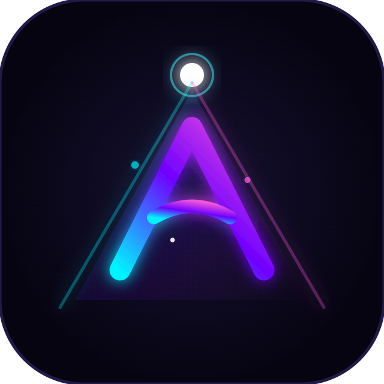

# Aurora Letras

Proyector de letras para Windows listo para instalar por **setup**.

  

  <a href="https://github.com/juandelgado4-droid/proyectar/releases/latest/download/Aurora%20Letras%20Setup%201.3.0.exe"><strong>Descargar Setup (Release)</strong></a>
  ·
  <a href="./dist/Aurora%20Letras%20Setup%201.3.0.exe"><strong>Setup en este repo (dist)</strong></a>

## Instalacion (usuario final)

1. Descarga `Aurora Letras Setup 1.3.0.exe`.
2. Ejecuta el instalador.
3. Elige carpeta de instalacion y termina el asistente.
4. Abre **Aurora Letras** desde el acceso directo.

> No necesitas Node.js ni comandos de terminal para instalar la app.

## Que incluye

- Proyeccion de letras sincronizadas en pantalla completa.
- Soporte de visuales/fondos y control de sincronizacion.
- Instalador de Windows listo para distribuir.

## Personalizacion de marca

- **Logo:** reemplaza [logo.png](logo.png).
- **Nombre y titulos:** ajusta [branding.js](branding.js).
- **Metadatos de app/instalador:** revisa [package.json](package.json) (`productName`, `appId`, version).