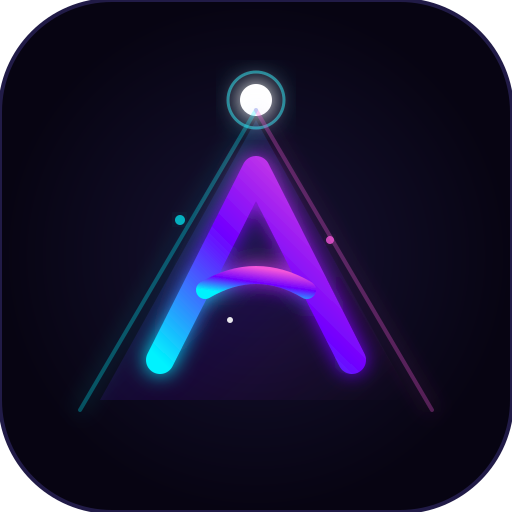

# Aurora Letras

<p align="center">
  
</p>

<p align="center">
  <strong>Proyector de letras sincronizadas con fondos dinámicos y generación visual por IA en tiempo real.</strong>
</p>

<p align="center">
  
  
  
  
</p>

<p align="center">
  <a href="./dist/Aurora%20Letras%20Setup%201.5.6.exe"><strong>⬇️ Descargar Instalador (v1.5.6 .exe)</strong></a>
  ·
  <a href="./dist/"><strong>📁 Carpeta dist</strong></a>
  ·
  <a href="./release/"><strong>🗄️ Historial de Releases</strong></a>
</p>

---

## 🚀 Instalación Rápida (Windows)

1. Descarga el instalador: **[Aurora Letras Setup 1.5.6.exe](./dist/Aurora%20Letras%20Setup%201.5.6.exe)**.
2. Ejecuta el archivo descargado y sigue los pasos del asistente.
3. Abre **Aurora Letras** desde el acceso directo del escritorio o menú de inicio.
4. Reproduce cualquier canción en Spotify, Apple Music o tu navegador: ¡la letra y el fondo se sincronizan automáticamente!

> 💡 *No requieres Node.js ni conocimientos técnicos para usar la aplicación.*

---

## ✨ Características Principales

### 🪄 Escena IA (Generación 2D por Canción)
- **ADN Visual por Letra:** Analiza automáticamente el texto de la canción y determina el escenario, paleta de color, partículas y atmósfera ideales.
- **Respiración Emocional:** La paleta del fondo se desliza suavemente en tiempo real adaptándose a la emoción de cada verso conforme avanza la letra.
- **14 Escenarios Procedurales:** Cosmos, Aurora, Bosque, Jardín, Océano, Lluvia, Fuego, Ciudad, Neón, Desierto, Nieve, Habitación, Ruinas y Carretera.
- **7 Sistemas de Partículas:** Lluvia, nieve, pétalos, brasas, polvo estelar, burbujas y luciérnagas.
- **Atmósfera y Post-procesado:** Bloom sutil, grano de película y viñeta cinematográfica.
- **100% Local y Ligero:** Sin depender de modelos pesados ni conexión externa; cálculo autónomo e instantáneo.

### 🌌 Catálogo de Fondos Visuales
| Fondo | Tipo | Descripción |
|---|---|---|
| **🪄 Escena IA** | Generativo 2D | Fondo vivo que se construye y respira con la letra actual |
| **🌌 Universo** | 3D WebGL | Núcleo galáctico interactivo, anillos luminosos y palabras en órbita |
| **✨ Estrellas** | 2D Canvas | Campo estelar profundo con nebulosas violeta/azul y estrellas titilantes |
| **🌸 Flores** | 2D Canvas | Caída de pétalos de sakura con viento y estelas suaves |
| **🔥 Fuego** | 2D Canvas | Llamas fluidas, brasas incandescentes y calor ascendente |
| **✨ Aurora** | 2D Canvas | Ondas boreales luminosas en movimiento continuo |
| **🌊 Océano** | 2D Canvas | Oleaje rítmico, burbujas y degradados submarinos |
| **☄️ Galaxia** | 2D Canvas | Espiral cósmica con rotación estelar |
| **🌅 Vapor Ámbar** | 2D Canvas | Ambiente cálido y relajante estilo cafetería |
| **🍄 Bosque Mágico** | 2D Canvas | Niebla orgánica y partículas bioluminiscentes |
| **🌧️ Lluvia Relajante** | 2D Canvas | Gotas de lluvia realistas con efecto de suelo mojado |
| **☁️ Nebulosa** | 2D Canvas | Nubes de gas estelar con resplandores suaves |
| **🖼️ Mis Fotos** | Multimedia | Galería automática desde tus carpetas locales |
| **🎥 Video Musical** | Web / Video | Búsqueda y reproducción automática del video oficial |

---

## 🎚️ Sincronización y Audio Reactivo

- **Detección Automática (SMTC):** Compatible con Apple Music, Spotify, YouTube Music, navegadores y reproductores de Windows.
- **Base de Datos de Letras (LRC & Plain):** Búsqueda sincronizada en tiempo real con caché local fuera de línea (IndexedDB).
- **Editor de Letra Manual (✎):** Permite pegar texto plano o timestamps `[00:12.34]` directamente en la app.
- **Ajuste de Sync en Vivo:** Slider de desfase en milisegundos (`±5000 ms`) para calibrar canciones con retraso de pista.
- **Modo Audio Reactivo:** Captura de audio opcional (micrófono o salida del sistema) para modular graves, medios y agudos en las partículas y capas del fondo.

---

## 🏷️ Personalización de Marca

- **Cambio de Logo Interactivo:** Pasa el ratón sobre el logo en la esquina inferior derecha, haz clic en **"Cambiar Logo"** y selecciona cualquier imagen (`.png`, `.svg`, `.jpg`, `.webp`). La app lo actualiza al instante sin reiniciar.
- **Personalización de Títulos:** Ajusta los nombres de la ventana en [branding.js](branding.js).
- **Guía detallada:** Consulta [CAMBIA-EL-LOGO.md](CAMBIA-EL-LOGO.md).

---

## 🛠️ Desarrollo y Compilación

Si deseas ejecutar o compilar el código fuente por tu cuenta:

```bash
# 1. Clonar el repositorio
git clone https://github.com/juandelgado4-droid/proyectar.git
cd proyectar

# 2. Instalar dependencias
npm install

# 3. Iniciar en modo desarrollo
npm start

# 4. Compilar instalador para Windows x64
npm run build
```

Los instaladores resultantes se generan en la carpeta `dist/`.

---

## 📂 Estructura del Proyecto

```
proyectar/
├── app.js                       # Lógica principal, sincronizador y fondos 2D
├── index.html                   # Interfaz de usuario y controles
├── main.js                      # Proceso principal de Electron y ventanas
├── branding.js                  # Configuración de marca y títulos
├── sync-engine.js               # Motor de predicción y renderizado de letra
├── scene-engine/
│   └── templates/
│       ├── TemplateDNA.js       # Extractor de ADN visual desde la letra
│       └── TemplateRenderer.js  # Renderizador 2D por capas y partículas
├── assets/                      # Fuentes, iconos y librerías auxiliares
├── dist/                        # Instalador listo para distribución (.exe)
└── release/                     # Historial de versiones compiladas
```

---

## 📄 Licencia

Este proyecto está distribuido bajo la licencia **[MIT](./LICENSE)**.
